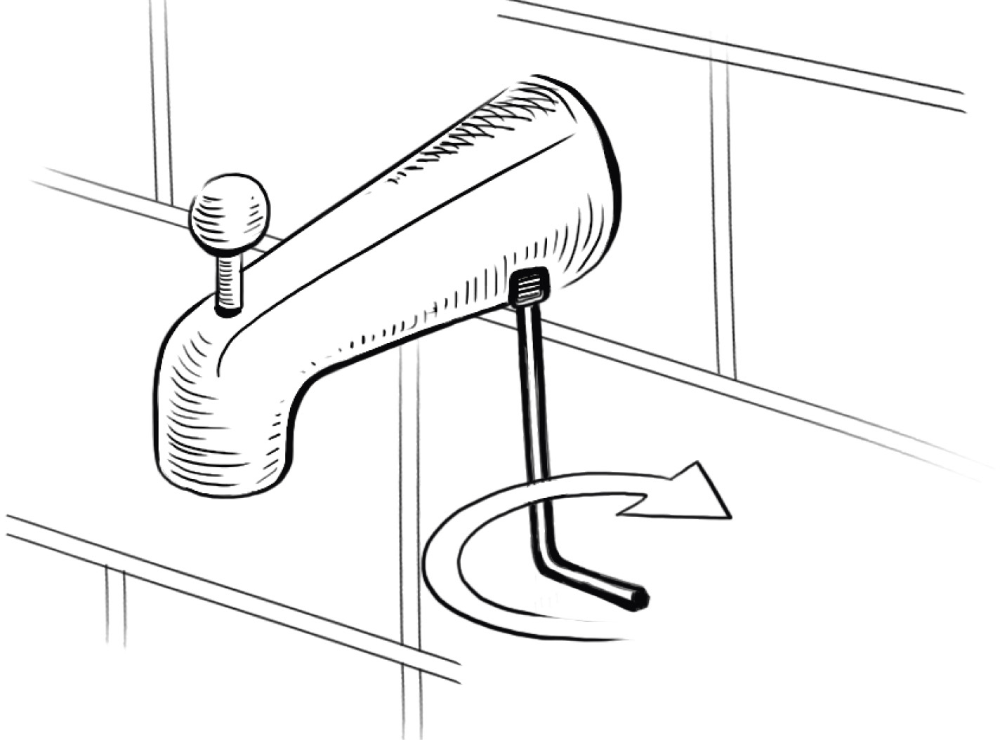

# Week 11 Report — Video Generation & Model Use Cases

**Author:** Manuel “Manny” Buffa  
**Course/Track:** Capstone Local LLM Deployment  
**Weeks Covered:** 9–11 (consolidated in Week 11 submission)  
**Repo Path:** `/home/manny-buff/projects/capstone/week11-hw/`

---

## 1. Objectives (from brief)
- [ ] Implement/compare video generation and/or video-conditioned pipelines.
- [ ] Demonstrate at least two distinct **use cases** (e.g., text→video, image→video, video editing or guidance).
- [ ] Provide **evaluation artifacts** (automatic + qualitative) and **reproducible** notebooks.
- [ ] Document constraints, resources, and failure modes.

> Will be finalized after parsing the Week 11 rubric/brief.

---

## 2. Datasets & Inputs
- Source materials: (list PDFs, sample clips, prompts)
- Any external videos/images used: (paths under `data/` or `data/external/`)

---

## 3. Models & Tooling
- Baseline model(s): (name, version, source)
- Optional adapters/controls: (e.g., depth, motion, keyframe guidance)
- Inference runtime: (GPU/CPU, precision, batch/frames, memory notes)

---

## 4. Pipelines
### 4.1 Text → Video
- Prompt template
- Generation steps (frames/sec, duration, resolution)
- Save locations (under `visual_outputs/`)

### 4.2 Image/Video → Video (if applicable)
- Conditioning assets
- Transformation/controls
- Outputs

> Add more subsections for each use case.

---

## 5. Evaluation
### 5.1 Automatic
- FVD / CLIPScore / aesthetic or motion-consistency proxy
- Runtime, VRAM, throughput

### 5.2 Qualitative
- Visual inspection grid or storyboard
- Notes on temporal coherence, identity consistency, artifacts

---

## 6. Results
- Tables/figures of key metrics
- Representative frames/gifs (thumbnails) with paths
- Discussion: strengths, limitations, and failure cases

---

## 7. Reproducibility
- Environment: Python, CUDA, driver summary
- Entry notebooks: `notebooks/Week11-A.ipynb` …
- Config: `configs/week11_run_config.json`
- Exact commands/cell order to run end-to-end

---

## 8. Compute & Time Budget
- GPU: model name, VRAM
- Total wall-clock for main runs
- Caching, checkpointing, or partial renders

---

## 9. References
- Papers, model cards, datasets, tutorials (cite here)

---

## Appendix
- Full prompts, extended tables, additional samples

# Week 10 Team Report (1 page)

Team:
Domain:
Model and Device:

## Metrics
| Metric | Value | Notes |
|---|---:|---|
| Latency (ms/query) |  |  |
| Real-Time Factor (RTF) |  |  |
| Sequence Accuracy |  |  |
| Rep/Event MAE |  |  |
| Spatial IoU |  |  |
| Event F1 |  |  |

## Example Results
- Screenshots or overlays of spatial grounding
- Temporal reasoning outputs

## Reflection
- What prior modules were reused (GraphRAG/UI/eval)?
- What worked well and what needs improvement?

---
## Week11-HO-2 Summary (VLM → SVD)
_Append timestamp: 2025-11-04 09:51:08_

**What worked**
- Vision-Language (Qwen2-VL) produced concise, step-by-step faucet guidance.
- Stable Video Diffusion produced short clips when a suitable source image was selected.

**What didn’t**
- Automated image retrieval frequently surfaced unusable pages (blank/over-compressed/repetitive).
- Video fidelity was highly sensitive to source image quality and parameters.

**Conclusion**
- The end-to-end process <u>could</u> be accomplished, but a **customized image selector** is required and will still need **significant human intervention** to curate usable inputs. Video generation is even more sensitive and demands careful, manual tuning.

**Curated image (for rubric/demo):** `artifacts/curated/faucet_spout.png`

**Curated video (for rubric/demo):** `artifacts/curated/svd_example.mp4`

[Download curated video](../artifacts/curated/svd_example.mp4)

